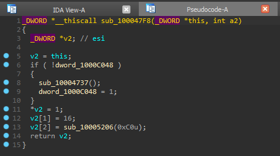

# bao - the PDB compiler

_bao_ allows you to generate debug information from C code in the **CodeView** format, which is mostly known for its use in **PDBs**.
**JSON** is used to assign the types and functions to addresses within the binary.

# Showcase

To showcase how _bao_ works I will use a module from Valve's anti-cheat "solution" VAC.
It's an ideal sample to test on, because the modules are rather small and as such can be fully analyzed very easily.
Complimenting these conditions is the fact that the different modules are similar to each other as all of them I've analyzed contain the ICE cipher. 

## Before 


## After applying a generated PDB by Bao


### Code 
```c
int ice_sboxes_initialised;
struct IceKey {
    int		_size;
    int		_rounds;
    struct  IceSubkey	*_keysched;
};

struct IceKey* __thiscall IceKey__IceKey(struct IceKey*, int nRounds);
void* __fastcall VAC_malloc(size_t dwBytes);
void ice_sboxes_init(void);
```

### Configuration

```json
{
  "functions": [
    {
      "name": "IceKey__IceKey",
      "pattern": "56 57 33 FF"
    },
    {
      "name": "VAC_malloc",
      "pattern": "E8 ? ? ? ? 89 7E 04",
      "extra": 1,
      "rip_relative": true,
      "rip_offset": 4
    },
    {
      "name": "ice_sboxes_init",
      "pattern": "75 0B E8 ? ? ? ?",
      "extra": 3,
      "rip_relative": true,
      "rip_offset": 4
    }
  ],
  "globals": [
    {
      "name": "ice_sboxes_initialised",
      "pattern": "47 83 3D ? ? ? ? ?",
      "offsets": [
        3
      ],
      "relative": true
    }
  ]
}
```

# Dependencies

- **LLVM 10** is used to generate the resulting PDB files. This is delegated to the accompanying [pdb_wrapper](https://github.com/not-wlan/pdb_wrapper).
- **Clang 10** is used for parsing the C files. This enables us to use the powerful preprocessor.

# Known issues

- **enums** are **not** supported (yet?).
- **unions** are **not** supported (yet?).
- **C++** support is experimental and untested.
- Functions that don't have parameters will not be assigned a type by IDA Pro. This might be a bug in IDA Pro.
- The GUID and age from the original binary aren't applied to the generated PDB. This means that you'll have to confirm an extra warning dialog in IDA Pro when loading the PDB.
- The memory model is LLP64 (`sizeof(long) == 4`), regardless of host platform.

# Usage

Generating the PDB as seen in [the example](#Showcase) is as easy as running `bao -c config.json -- vac.dll src/structs.c`.
The resulting PDB will be saved as `vac.dll.pdb` in this example.
You may pass the `-o` option to save the resulting PDB somewhere else.

# Setup

The easiest way to run _bao_ is to use [Docker](https://www.docker.com/):

```bash
~$ git clone https://github.com/not-wlan/bao.git
~$ cd bao
~$ docker build . -t bao:latest
~$ docker run -v /path/to/project:/project -it bao:latest
#$ cd /project
#$ bao -o vac.pdb -c vac.json vac.dll structs.c
```

The first three commands are only necessary on your first run or after an update of _bao_.

Alternatively you can install the dependencies on your own machine. Be warned though, this is not recommended on a Windows machine!

# Usecases

You can use _bao_ to:

- transfer your reverse engineering efforts from one version of a binary to another one
- emulate virtual method tables by building structs of function pointers
- generate PDBs from leaked source code that wouldn't build in its entirety
- transfer your reverse engineering efforts from one tool to another one 

# Thanks to

- [FakePDB](https://github.com/Mixaill/FakePDB) for inspiring this project and helping me with some of the LLVM API calls.
- [hazedumper-rs](https://github.com/frk1/hazedumper-rs) for the pattern format.
- All the people who have helped me along the way.
